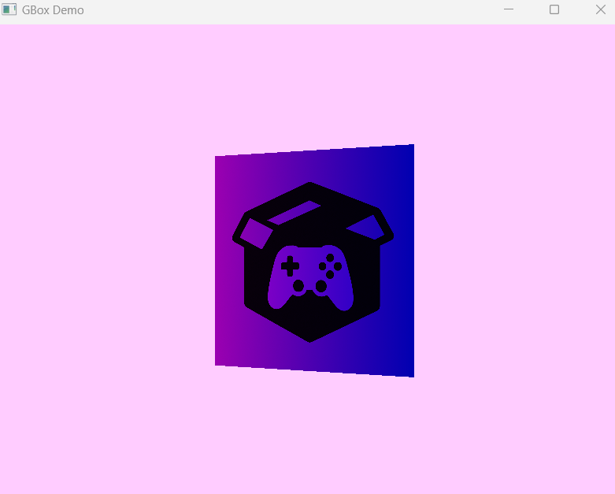

# GameBox
a nice game engine in c#

Yo guys... we are here to make a the best games
hope to use this engine as a nice tool for yourself 

#### Documention
you can read about how to use GameBox [here](https://imthesadra.github.io/gamebox)

#### How to build?
thats too easy...

if you are using windows 

------------------------
`git clone https://github.com/imthesadra/gamebox.git`
- then endit the build.bat file 
- set `SDL` `LUA` `GLEW` paths that you have on your system
- run `build.bat` file

if you are suing linux

----------------------
- install sdl2 lua and glew
- then just run `build.sh` file

#### Tell us your ideas
you can tell us your idea for this Game box from [here](mailto:m.sadra.gorji@gmail.com)
and also if you can make this engine better you can pull it from [here](https://github.com/ImTheSadra/GameBox/pulls)
